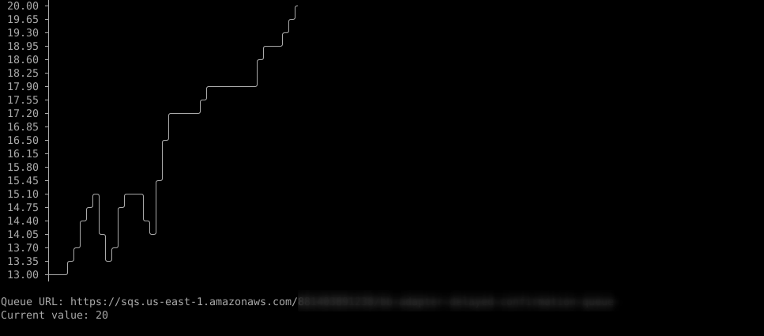

## SQS Graph

View metrics for AWS SQS queues in your terminal.



<hr>

## Flags

```
  -interval int
    	Internal to updating graph (default 10)
  -metric string
    	The metric name to visualize in the graph
        (default "ApproximateNumberOfMessages")
  -queue string
    	The url of the SQS queue
```

## Build

```sh
go build
```

## Example

```sh
sqsgraph -queue <queue url>
```
